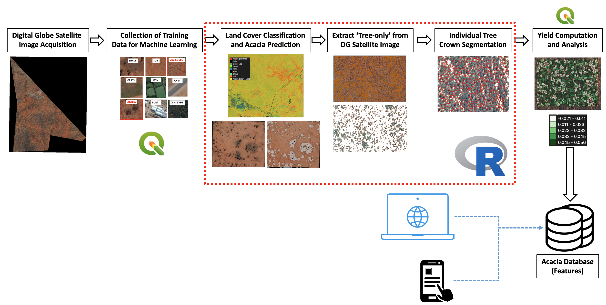

---
## World Food Programme - UNIDO project
---
### Application of Machine Learning and geospatial techniques for individual Acacia tree species mapping

#### The project aims to develop a novel approach of automating the detection of Acacia species from very high resolution satellite imagery. The system would then do image segmentation to identify individual Acacia tree crowns. A correlation betweek crown area and volume was then applied to infer volume of Acacia over a large area. The script is written in pure R using geospatial libraries to automate the task.

### Detailed documentation will be provided soon. This is a work in progress
---
#### Main Developer: Michael Manalili (WFP)
#### Remote Sensing Specialist: Sirio Modugno, PhD (WFP)
#### Project Manager: Ashraf Abushady (UNIDO)
---
#### Bug Fixes

Error: Kappa metric values are missing

Issue: Data error (raster input)

Solution:
Please Check the Satellite Image or the Drone image and make sure it is in Multi-Color 3 Bands only and not in 4 Bands! If you are processing your image under ESRI ArcGIS, the software would automatically add a 4th Band called “Alpha” which improves the image for visualization.  However, the script is designed to calculate the Kappa metric values for 3 Bands only as that is the common standard in GIS.

---